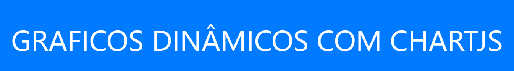
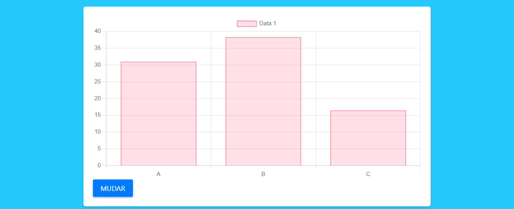
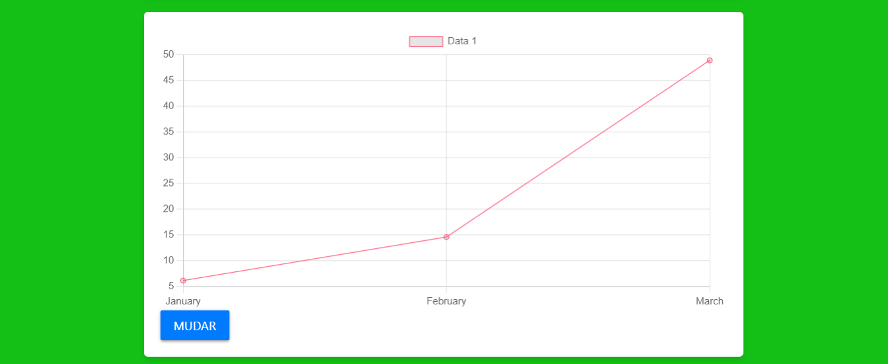
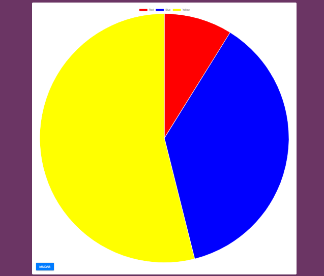
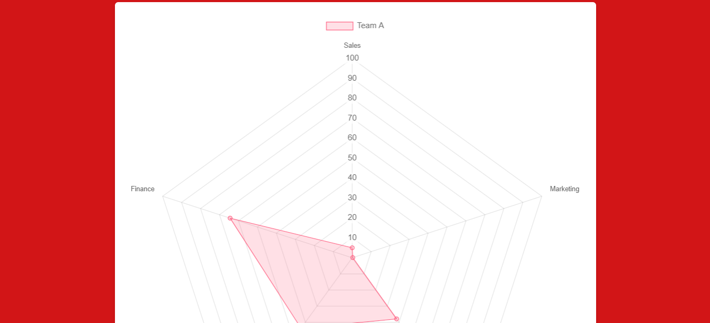
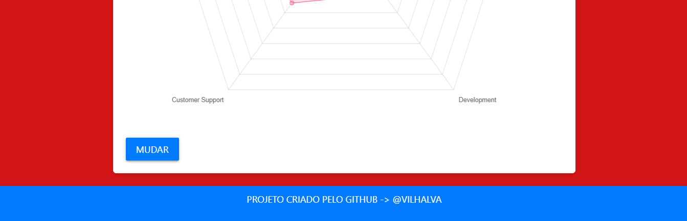

# GRAFICOS COM CHARTJS
👨‍🏫4 TIPOS DE GRAFICOS DINÂMICOS COM CHARTJS (APENAS O FRONT-END).

  
  
  
  
  
  

## DESCRIÇÃO:
O projeto "Gráficos com Chart.js" é uma aplicação web que permite a visualização e manipulação de gráficos interativos usando a biblioteca Chart.js. Esta aplicação oferece uma variedade de gráficos, incluindo barras, linhas, pizza e radar, e permite ao usuário alterar dinamicamente os dados exibidos nos gráficos.

## FUNCIONALIDADES:
1. **Visualização de Gráficos**: A aplicação fornece diferentes tipos de gráficos, como barras, linhas, pizza e radar, para representar dados de forma visualmente atraente.

2. **Manipulação de Dados**: Os gráficos podem ser atualizados dinamicamente com novos dados, permitindo ao usuário explorar diferentes conjuntos de dados e observar as mudanças nos gráficos em tempo real.

3. **Temas de Fundo Aleatórios**: Ao clicar em qualquer botão na aplicação, o tema de fundo é alterado aleatoriamente, proporcionando uma experiência visual dinâmica e divertida.

## COMO USAR?
1. **Abrindo App:** Abra o `./CODIGO/CODIGO.html` no navegador de sua preferência.

2. **Seleção de Gráficos**: Escolha o tipo de gráfico que deseja visualizar clicando nos botões correspondentes (MUDAR).

3. **Atualização de Dados**: Cada gráfico possui um botão associado que permite alterar os dados exibidos no gráfico. Clique no botão para gerar novos dados aleatórios e atualizar o gráfico.

4. **Mudança de Tema de Fundo**: Cada vez que um botão é clicado para atualizar os dados do gráfico, o tema de fundo da aplicação muda aleatoriamente. Isso adiciona uma camada de dinamismo visual à experiência do usuário.

## NÃO SABE?
- Entendemos que para manipular arquivos em `HTML`, `CSS` e outras linguagens relacionadas, é necessário possuir conhecimento nessas áreas. Para auxiliar nesse aprendizado, oferecemos cursos gratuitos disponíveis:
* [CURSO DE HTML E CSS](https://github.com/VILHALVA/CURSO-DE-HTML-E-CSS)
* [CURSO DE CHARTJS](https://github.com/VILHALVA/CURSO-DE-CHARTJS)
* [CURSO DE JAVASCRIPT](https://github.com/VILHALVA/CURSO-DE-JAVASCRIPT)
* [CURSO DE BOOTSTRAP](https://github.com/VILHALVA/CURSO-DE-BOOTSTRAP)
* [CURSO DE MATERIALIZECSS](https://github.com/VILHALVA/CURSO-DE-MATERIALIZECSS)
* [CONFIRA MAIS CURSOS](https://github.com/VILHALVA?tab=repositories&q=+topic:CURSO)

## CREDITOS:
- [PROJETO CRIADO PELO VILHALVA](https://github.com/VILHALVA)